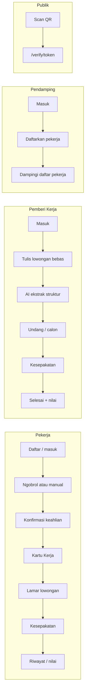

# Kita Kerja

Portal pekerjaan informal & layanan jaringan lokal — **Web Development Competition, Veternity Beraksi 2026** (Sub-tema 1: Informal Job Portal & Local Network Service).

**Tesis produk:** pekerja informal Indonesia tidak kekurangan pengalaman. Mereka kekurangan bukti.

Tagline: bukti pengalaman untuk pekerja informal Indonesia. Inti produk = mengubah pengalaman yang sudah ada menjadi **Kartu Kerja** (bukti portabel). Pencocokan lowongan adalah akibat dari itu.

## Live URL

Deployment skipped for now — run `npx vercel login`, then deploy and update this URL.

## Getting started

```bash
cp .env.example .env.local
# isi GEMINI_*, GROQ_*, Supabase, APP_URL, DEMO_MODE
npm install
npm run dev
```

Build:

```bash
npm run build
```

Detail env: lihat [`.env.example`](.env.example). Model Gemini 2.0 Flash / Flash-Lite sudah shutdown (Juni 2026) — pakai id yang masih hidup untuk key Anda (contoh di `.env.example`).

## Stack

- Next.js 16 (App Router, TypeScript)
- Tailwind CSS v4 · shadcn/ui
- Supabase (Postgres + Auth + Storage)
- Gemini API (server-side only) · Groq Whisper (transkrip audio wawancara)
- Zod

## Sumber kanonis

Dokumen ini = overview produk + setup. Spek/detail lain:

| Dokumen | Isi |
|---------|-----|
| [`CONTEXT.md`](CONTEXT.md) | Kosakata produk & larangan istilah |
| [`PROMPT_KITA_KERJA.md`](PROMPT_KITA_KERJA.md) | Spek pembangunan lengkap |
| [`PRODUCT.md`](PRODUCT.md) | Suara merek, prinsip desain, aksesibilitas |
| [`docs/adr/`](docs/adr/) | Keputusan teknis (ADR) |
| [`docs/agents/`](docs/agents/) | Proses issue & triage agen |

---

## Masalah dan solusi

| Tanpa Kita Kerja | Dengan Kita Kerja |
|------------------|-------------------|
| Tidak ada CV / sertifikat / slip gaji | **Kartu Kerja** — kredensial cetak + QR |
| Referensi hanya “tanya tetangga” | Verifikasi publik tanpa akun |
| Setiap pemberi kerja baru = mulai dari nol | Riwayat & lapis kepercayaan ikut kartu |
| Lowongan berisiko sulit dibaca | **Saringan Aman** + pertanyaan saran |
| Upah kabur | **Upah Terang** (acuan UMK, bukan tebakan AI) |

**Keberhasilan singkat:** pekerja menyelesaikan Ngobrol Kerja (atau isi manual), punya kartu yang bisa diverifikasi orang asing; pemberi kerja merekrut dari bukti, bukan tebakan.

---

## Empat audiens

Istilah UI mengikuti [`CONTEXT.md`](CONTEXT.md).

| Peran | Siapa | Job to be done |
|-------|--------|----------------|
| **Pekerja** | Tukang, ART, teknisi, dll. Pemilik Kartu Kerja. | Ubah pengalaman jadi bukti yang bisa dibawa. |
| **Pemberi Kerja** | Rumah tangga, warung, kontraktor kecil — **bukan** HRD. | Cari orang yang bisa dipercaya, cepat. |
| **Pendamping** | Kelurahan / karang taruna / RT. | Daftarkan & dampingi pekerja; akun tetap milik pekerja. |
| **Publik** | Siapa pun yang scan QR kartu. | Pahami kartu dalam ~5 detik, tanpa login. |

Persona demo: **Pak Warto** (pekerja, Malang), **Mbak Dhika** (pemberi kerja), **Pak Slamet** (pendamping), **Bu Yanti** (pekerja baru).

---

## Enam pilar produk

| Pilar | Fungsi |
|-------|--------|
| **Ngobrol Kerja** | Wawancara kompetensi adaptif berbasis suara; jalur **isi manual** selalu ada. |
| **Kartu Kerja** | Kredensial cetak, ber-QR, diverifikasi tanpa akun; tiga **lapis kepercayaan**. |
| **Saringan Aman** | Menandai pola lowongan berisiko + saran pertanyaan — tidak menyatakan “penipuan”. |
| **Upah Terang** | Acuan upah per keahlian/wilayah berbasis UMK; AI **tidak** mengubah angka upah. |
| **Kesepakatan Kerja** | Perjanjian digital, konfirmasi dua pihak; tanpa escrow; penegakan lewat reputasi. |
| **Pencocokan** | Berbasis taksonomi keahlian (deterministik), bukan embedding; alasan pencocokan ditampilkan. |

---

## Alur utama per peran



### Pekerja

1. Daftar / masuk (email + kata sandi).
2. **Ngobrol Kerja** (`/worker/interview`) atau **isi manual** (`/worker/interview/manual`).
3. Periksa & konfirmasi keahlian (`/worker/interview/result`).
4. Lihat / cetak **Kartu Kerja** (`/worker/card`).
5. Jelajahi & lamar lowongan (`/worker/jobs`, …).
6. Kelola lamaran & kesepakatan; riwayat & penilaian (`/worker/history`).

### Pemberi Kerja

1. Masuk → beranda (`/employer`).
2. Tulis kebutuhan bebas di `/employer/post` → AI ekstrak → tinjau di `/employer/post/result`.
3. Kelola lowongan & calon (`/employer/jobs/...`).
4. Undang / buat kesepakatan → konfirmasi dua pihak.
5. Tandai selesai & beri penilaian (`/employer/complete/[id]`).

### Pendamping

1. Masuk → daftar pekerja didampingi (`/companion`).
2. Daftarkan pekerja (`/companion/register`) — **email + kata sandi** + wilayah (email asli wajib; tanpa email sementara / klaim SMS).
3. Bantu pekerja masuk sendiri untuk Ngobrol Kerja; pendamping mendampingi di sampingnya.

### Publik

1. Scan QR di Kartu Kerja.
2. Buka `/verify/[token]` (tanpa login).

---

## Peta rute

Spek lama memakai path Indonesia (`/pekerja/...`). **Kode memakai path Inggris:**

### Publik — `(public)/`

| Rute | Keterangan |
|------|------------|
| `/` | Landing |
| `/cara-kerja` | Cara kerja |
| `/lowongan`, `/lowongan/[id]` | Jelajah lowongan tanpa akun |
| `/sign-in`, `/register` | Masuk / daftar |
| `/verify/[token]`, `/verify/contoh` | Verifikasi Kartu Kerja |
| `/claim/[id]` | Deprecated → redirect `/sign-in` |

### Pekerja — `(worker)/worker/`

| Rute | Keterangan |
|------|------------|
| `/worker` | Beranda |
| `/worker/interview` | Ngobrol Kerja |
| `/worker/interview/manual` | Isi keahlian manual |
| `/worker/interview/result` | Konfirmasi keahlian |
| `/worker/card`, `/worker/card/print` | Kartu Kerja / cetak |
| `/worker/jobs`, `/worker/jobs/[id]` | Lowongan + lamar |
| `/worker/applications` | Lamaran |
| `/worker/agreements/[id]` | Kesepakatan |
| `/worker/history` | Riwayat & penghasilan |
| `/worker/profile` | Profil |

### Pemberi Kerja — `(employer)/employer/`

| Rute | Keterangan |
|------|------------|
| `/employer` | Beranda |
| `/employer/post`, `/employer/post/result` | Posting + hasil ekstrak AI |
| `/employer/jobs`, `/employer/jobs/[id]`, `.../candidates` | Kelola lowongan & calon |
| `/employer/agreements`, `/employer/agreements/[id]` | Kesepakatan |
| `/employer/complete/[id]` | Selesai + nilai |

### Pendamping — `(companion)/companion/`

| Rute | Keterangan |
|------|------------|
| `/companion` | Daftar pekerja didampingi |
| `/companion/register` | Daftarkan pekerja |

### Demo

| Rute | Keterangan |
|------|------------|
| `/demo`, `/demo/component` | Panel demo (hanya jika `DEMO_MODE`) |

Middleware melindungi `/worker`, `/employer`, `/companion` menurut **peran**. `/verify` publik tanpa sesi peran.

---

## Konsep domain

### Kartu Kerja

Kredensial milik **Pekerja**, bisa dicetak, punya QR, diverifikasi publik. Bukan “profil” atau “CV” dalam bahasa produk.

### Keahlian Baku

Taksonomi resmi. Teks bebas dinormalisasi ke Keahlian Baku; yang tidak cocok tetap diklaim sendiri.

### Lapis kepercayaan

Dihitung dari riwayat — **tidak disimpan** sebagai field tetap:

| Lapis | Arti |
|-------|------|
| **Terverifikasi** | Ada pekerjaan selesai (dua pihak) yang butuh keahlian itu. |
| **Dinilai** | Ada penilaian pada pekerjaan terkait keahlian itu. |
| **Diklaim** | Dari Ngobrol/manual + dikonfirmasi pekerja; belum ada pekerjaan yang membuktikan. |

### Lamaran & pencocokan

Engine taksonomi (`src/lib/engine/matching.ts`) — bukan embedding vektor.

### Kesepakatan Kerja

Perjanjian digital; konfirmasi dua pihak. OTP masih dipakai di alur kesepakatan (mode demo: lihat ADR-0001). Bukan escrow.

### Saringan Aman & Upah Terang

Saringan menandai risiko + saran pertanyaan. Upah Terang = benchmark deterministik (UMK); AI tidak boleh menyentuh angka upah.

---

## Autentikasi dan demo

- **Masuk / daftar:** email + kata sandi (Supabase Auth).
- **Nomor HP:** kontak opsional, **bukan** kunci login.
- **Kesepakatan:** OTP terpisah dari login.

### Persona seed (contoh)

| Persona | Email | Peran |
|---------|-------|--------|
| Warto Sugianto | `warto@kitakerja.test` | pekerja (kartu lengkap) |
| Yanti Puspitasari | `yanti@kitakerja.test` | pekerja (baru) |
| Dhika Ayu Permata | `dhika@kitakerja.test` | pemberi_kerja |
| Slamet Riyadi | `slamet@kitakerja.test` | pendamping |

Kata sandi demo: `DEMO_FALLBACK_PASSWORD` (lihat `.env.example` / seed). Panel `/demo` jika `DEMO_MODE=true`.

---

## Struktur folder

| Path | Peran |
|------|--------|
| `src/app/(public\|worker\|employer\|companion)/` | Halaman per peran |
| `src/app/api/` | Auth, AI, kartu, lamaran, kesepakatan, match, demo |
| `src/lib/ai/` | Gemini, Groq, prompt, kuota, guard |
| `src/lib/engine/` | Matching, risiko, upah, resolver keahlian, jarak |
| `src/lib/data/` | Baca domain |
| `src/lib/auth/`, `src/lib/supabase/` | Sesi & klien Supabase |
| `src/component/` | UI |
| `supabase/migrations/`, `supabase/seed.ts` | Skema & data demo |

---

## Di mana AI dipakai

| Fitur | Area | Batas penting |
|-------|------|---------------|
| Ngobrol Kerja | `api/ai/interview/*` + Groq transkrip | Kutipan bukti wajib; jalur manual selalu ada. |
| Ekstrak lowongan | `api/ai/jobs/extract` | Teks bebas → struktur untuk ditinjau manusia. |
| Saringan | engine + AI | Menandai pola, bukan vonis penipuan. |

Kunci Gemini & service role hanya di server. Jika model/kuota/jaringan gagal: pesan Indonesia + **isi manual**.

---

## Spek ↔ kode

| Topik | Spek lama | Implementasi |
|-------|-----------|--------------|
| Login | HP + OTP | Email + kata sandi |
| Path URL | `/pekerja`, `/pemberi`, … | `/worker`, `/employer`, … |
| Versi Next | “Next 15” di sebagian agen | Next **16** |
| Klaim SMS / email sementara dampingan | Era HP sintetis | Deprecated / ditolak (register email asli) |

Saat ragu: **kode + `CONTEXT.md` + ADR terbaru** mengalahkan spek usang.

---

## Ringkas

Kita Kerja mengubah pengalaman lisan pekerja informal menjadi **Kartu Kerja** yang bisa diverifikasi siapa pun, lalu memakai bukti itu untuk lowongan, kesepakatan, dan reputasi yang tidak hangus saat pindah tempat.
