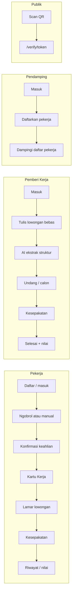

# Overview Aplikasi — Kita Kerja

Dokumen ini merangkum **apa itu Kita Kerja**, siapa penggunanya, alur utama, rute yang diimplementasikan, konsep domain, stack teknis, demo, dan AI — untuk tim, QA, dan juri yang butuh gambaran utuh tanpa membaca spek penuh.

Sumber kanonis (jangan digantikan dokumen ini):

| Dokumen | Isi |
|---------|-----|
| [`CONTEXT.md`](../CONTEXT.md) | Kosakata produk & larangan istilah |
| [`PROMPT_KITA_KERJA.md`](../PROMPT_KITA_KERJA.md) | Spek pembangunan lengkap |
| [`PRODUCT.md`](../PRODUCT.md) | Suara merek, prinsip desain, aksesibilitas |
| [`docs/adr/`](./adr/) | Keputusan teknis (ADR) |
| [`README.md`](../README.md) | Setup lokal |

---

## 1. Apa itu Kita Kerja

**Kita Kerja** adalah portal pekerjaan informal & layanan jaringan lokal untuk kompetisi **Web Development Competition — Veternity Beraksi 2026** (Sub-tema 1: Informal Job Portal & Local Network Service).

**Tesis produk:**

> Pekerja informal Indonesia tidak kekurangan pengalaman. Mereka kekurangan bukti.

Tagline di landing: bukti pengalaman untuk pekerja informal Indonesia. Produk tidak “menciptakan” lowongan sebagai inti; yang diutamakan adalah mengubah pengalaman yang sudah ada menjadi **bukti portabel** (Kartu Kerja). Pencocokan lowongan adalah akibat dari itu.

Konteks data (untuk narasi landing): puluhan juta pekerja informal di Indonesia; reputasi mereka sering lisan, lokal, dan hilang saat pindah tempat.

---

## 2. Masalah dan solusi

| Tanpa Kita Kerja | Dengan Kita Kerja |
|------------------|-------------------|
| Tidak ada CV / sertifikat / slip gaji | **Kartu Kerja** — kredensial cetak + QR |
| Referensi hanya “tanya tetangga” | Verifikasi publik tanpa akun |
| Setiap pemberi kerja baru = mulai dari nol | Riwayat & lapis kepercayaan ikut kartu |
| Lowongan berisiko sulit dibaca | **Saringan Aman** + pertanyaan saran |
| Upah kabur | **Upah Terang** (acuan UMK, bukan tebakan AI) |

**Keberhasilan singkat:** pekerja menyelesaikan Ngobrol Kerja (atau isi manual), punya kartu yang bisa diverifikasi orang asing; pemberi kerja merekrut dari bukti, bukan tebakan.

---

## 3. Empat audiens

Istilah UI mengikuti [`CONTEXT.md`](../CONTEXT.md) (hindari padanan Inggris di copy produk).

| Peran | Siapa | Job to be done |
|-------|--------|----------------|
| **Pekerja** | Tukang, ART, teknisi, dll. Pemilik Kartu Kerja. | Ubah pengalaman jadi bukti yang bisa dibawa. |
| **Pemberi Kerja** | Rumah tangga, warung, kontraktor kecil — **bukan** HRD. | Cari orang yang bisa dipercaya, cepat. |
| **Pendamping** | Kelurahan / karang taruna / RT. | Daftarkan & dampingi pekerja tanpa smartphone; akun tetap milik pekerja. |
| **Publik** | Siapa pun yang scan QR kartu. | Pahami kartu dalam ~5 detik, tanpa login. |

Persona demo umum: **Pak Warto** (pekerja, Malang), **Mbak Dhika** (pemberi kerja), **Pak Slamet** (pendamping), **Bu Yanti** (pekerja baru / belum punya kartu).

---

## 4. Enam pilar produk

| Pilar | Fungsi |
|-------|--------|
| **Ngobrol Kerja** | Wawancara kompetensi adaptif berbasis suara; jalur **isi manual** selalu ada. |
| **Kartu Kerja** | Kredensial cetak, ber-QR, diverifikasi tanpa akun; tiga **lapis kepercayaan**. |
| **Saringan Aman** | Menandai pola lowongan berisiko + saran pertanyaan — tidak menyatakan “penipuan”. |
| **Upah Terang** | Acuan upah per keahlian/wilayah berbasis UMK; AI **tidak** mengubah angka upah. |
| **Kesepakatan Kerja** | Perjanjian digital, konfirmasi dua pihak (OTP khusus kesepakatan); tanpa escrow; penegakan lewat reputasi. |
| **Pencocokan** | Berbasis taksonomi keahlian (deterministik), bukan embedding; alasan pencocokan ditampilkan. |

---

## 5. Alur utama per peran

### Pekerja

1. Daftar / masuk (email + kata sandi).
2. **Ngobrol Kerja** (`/worker/interview`) atau **isi manual** (`/worker/interview/manual`).
3. Periksa & konfirmasi keahlian (`/worker/interview/result`).
4. Lihat / cetak **Kartu Kerja** (`/worker/card`).
5. Jelajahi & lamar lowongan (`/worker/jobs`, …).
6. Kelola lamaran & kesepakatan; setelah selesai, riwayat & penilaian (`/worker/history`).

### Pemberi Kerja

1. Masuk → beranda (`/employer`).
2. Tulis kebutuhan kerja bebas di `/employer/post` → AI mengekstrak struktur → tinjau di `/employer/post/result`.
3. Kelola lowongan & calon (`/employer/jobs/...`).
4. Undang / buat kesepakatan → konfirmasi dua pihak.
5. Tandai selesai & beri penilaian (`/employer/complete/[id]`).

### Pendamping

1. Masuk → daftar pekerja didampingi (`/companion`).
2. Daftarkan pekerja baru (`/companion/register`) — alur selaras register: **email + kata sandi** + wilayah; akun milik pekerja, pendamping hanya mendampingi.
3. Bantu pekerja yang belum punya Kartu Kerja (wawancara / manual atas nama alur produk).

**Catatan status produk (QA):** masih ada sisa alur lama seperti **tautan klaim** (`/claim/[id]`, SMS OTP) dan opsi **email sementara** di UI register dampingan. Keputusan produk terkini cenderung: setelah pekerja didaftarkan dengan email + password, klaim SMS tidak diperlukan; email sementara tidak boleh dipakai. Lihat issue GitHub terkait.

### Publik

1. Scan QR di Kartu Kerja cetak / digital.
2. Buka `/verify/[token]` (tanpa login) — lihat identitas, keahlian + lapis, ringkasan bukti.

---

## 6. Peta rute (implementasi)

Spek di `PROMPT_KITA_KERJA.md` memakai path berbahasa Indonesia (`/pekerja/...`). **Kode yang jalan memakai path Inggris** di App Router:

### Publik — `(public)/`

| Rute | Keterangan |
|------|------------|
| `/` | Landing |
| `/cara-kerja` | Cara kerja |
| `/lowongan`, `/lowongan/[id]` | Jelajah lowongan tanpa akun |
| `/sign-in`, `/register` | Masuk / daftar |
| `/verify/[token]`, `/verify/contoh` | Verifikasi Kartu Kerja |
| `/claim/[id]` | Klaim akun (alur lama dampingan) |

### Pekerja — `(worker)/worker/`

| Rute | Keterangan |
|------|------------|
| `/worker` | Beranda |
| `/worker/interview` | Ngobrol Kerja |
| `/worker/interview/manual` | Isi keahlian manual |
| `/worker/interview/result` | Konfirmasi keahlian |
| `/worker/card`, `/worker/card/print` | Kartu Kerja / cetak |
| `/worker/jobs`, `/worker/jobs/[id]` | Lowongan + lamar |
| `/worker/applications` | Lamaran |
| `/worker/agreements/[id]` | Kesepakatan |
| `/worker/history` | Riwayat & penghasilan |
| `/worker/profile` | Profil |

### Pemberi Kerja — `(employer)/employer/`

| Rute | Keterangan |
|------|------------|
| `/employer` | Beranda |
| `/employer/post`, `/employer/post/result` | Posting + hasil ekstrak AI |
| `/employer/jobs`, `/employer/jobs/[id]`, `.../candidates` | Kelola lowongan & calon |
| `/employer/agreements`, `/employer/agreements/[id]` | Kesepakatan |
| `/employer/complete/[id]` | Selesai + nilai |

### Pendamping — `(companion)/companion/`

| Rute | Keterangan |
|------|------------|
| `/companion` | Daftar pekerja didampingi |
| `/companion/register` | Daftarkan pekerja |

### Demo

| Rute | Keterangan |
|------|------------|
| `/demo`, `/demo/component` | Panel demo (hanya jika `DEMO_MODE`) |

Middleware (`src/middleware.ts`) melindungi `/worker`, `/employer`, `/companion` menurut **peran**. `/verify` dan `/claim` tidak memerlukan sesi peran tersebut.

---

## 7. Konsep domain

### Kartu Kerja

Artefak pusat: kredensial milik **Pekerja**, bisa dicetak, punya QR, diverifikasi publik. Bukan “profil” atau “CV” dalam bahasa produk.

### Keahlian Baku

Taksonomi resmi platform. Teks bebas dinormalisasi ke Keahlian Baku; yang tidak cocok tetap diklaim sendiri (self-declared).

### Lapis kepercayaan

Dihitung dari riwayat — **tidak disimpan** sebagai field tetap:

| Lapis | Arti |
|-------|------|
| **Terverifikasi** | Ada pekerjaan selesai (dua pihak) yang butuh keahlian itu. |
| **Dinilai** | Ada penilaian pada pekerjaan terkait keahlian itu. |
| **Diklaim** | Dari Ngobrol/manual + dikonfirmasi pekerja; belum ada pekerjaan yang membuktikan. |

### Lamaran & pencocokan

Pekerja melamar lowongan. Skor/alasan pencocokan dari engine taksonomi (`src/lib/engine/matching.ts`) — bukan embedding vektor.

### Kesepakatan Kerja

Perjanjian digital; konfirmasi dua pihak. OTP masih dipakai di alur kesepakatan (mode demo: kode tetap, lihat ADR-0001). Bukan escrow.

### Saringan Aman & Moderasi

Saringan menandai risiko + saran pertanyaan. Moderasi menahan terbit jika skor tinggi; pemberi bisa revisi atau konfirmasi eksplisit.

### Upah Terang

Benchmark deterministik (UMK / wilayah / keahlian). AI tidak boleh menyentuh angka upah.

---

## 8. Autentikasi dan demo

### Auth (implementasi saat ini)

- **Masuk / daftar:** email + kata sandi (Supabase Auth).
- **Nomor HP:** data kontak opsional, **bukan** kunci login (pergeseran dari model spek lama HP + OTP — lihat migrasi auth email / BUG-001).
- **Kesepakatan:** tetap memakai konfirmasi OTP (terpisah dari login).

### Persona seed (contoh)

| Persona | Email (domain uji) | Peran |
|---------|-------------------|--------|
| Warto Sugianto | `warto@kitakerja.test` | pekerja (kartu lengkap) |
| Yanti Puspitasari | `yanti@kitakerja.test` | pekerja (baru) |
| Dhika Ayu Permata | `dhika@kitakerja.test` | pemberi_kerja |
| Slamet Riyadi | `slamet@kitakerja.test` | pendamping |

Kata sandi demo: nilai `DEMO_FALLBACK_PASSWORD` (lihat `.env.example` / seed). Panel `/demo` (jika `DEMO_MODE`): ganti persona, reset data, simulasi gagal AI, dll.

---

## 9. Stack dan struktur folder

**Stack (repo):** Next.js 16 (App Router) · React 19 · TypeScript · Tailwind CSS v4 · shadcn/ui · Supabase (Postgres + Auth + Storage) · Gemini API (server-side saja) · Zod · (transkripsi audio lewat klien Groq di jalur wawancara).

| Path | Peran |
|------|--------|
| `src/app/(public\|worker\|employer\|companion)/` | Halaman per peran |
| `src/app/api/` | Auth, AI, kartu, lamaran, kesepakatan, match, demo |
| `src/lib/ai/` | Klien Gemini, prompt, kuota, guard |
| `src/lib/engine/` | Matching, risiko, upah, resolver keahlian, jarak |
| `src/lib/data/` | Baca domain (kartu, lowongan, lamaran, …) |
| `src/lib/auth/`, `src/lib/supabase/` | Sesi & klien Supabase |
| `src/component/` | UI pekerja / pemberi / kartu / bersama / publik |
| `supabase/migrations/`, `supabase/seed.ts` | Skema & data demo |

Setup cepat: lihat [`README.md`](../README.md).

---

## 10. Di mana AI dipakai

| Fitur | Endpoint / area | Batas penting |
|-------|-----------------|---------------|
| Ngobrol Kerja | `api/ai/interview/*` | Pertanyaan adaptif; ekstrak keahlian wajib punya **kutipan bukti** dari transkrip; jalur manual selalu tersedia. |
| Ekstrak lowongan | `api/ai/jobs/extract` | Teks bebas pemberi → struktur lowongan untuk ditinjau manusia. |
| Saringan / terkait risiko | engine + AI sesuai spek | Menandai pola, bukan vonis penipuan. |

Aturan mutlak (ringkas): kunci Gemini & service role hanya di server; AI tidak mengubah angka upah; jangan mengarang keahlian yang tidak disebut pekerja. Detail: `PROMPT_KITA_KERJA.md` Bagian 2 & 10, kode di `src/lib/ai/`.

Jika model tidak tersedia / kuota / jaringan gagal, UI menampilkan pesan Indonesia dan pekerja bisa beralih ke **isi manual**.

---

## 11. Cara membaca dokumen lain

| Butuh… | Baca… |
|--------|--------|
| Istilah yang boleh / dilarang di UI | [`CONTEXT.md`](../CONTEXT.md) |
| Spek halaman, skema, AI, kriteria selesai | [`PROMPT_KITA_KERJA.md`](../PROMPT_KITA_KERJA.md) |
| Suara merek & prinsip desain | [`PRODUCT.md`](../PRODUCT.md) |
| Kenapa OTP demo / geocoding / audio kartu | [`docs/adr/`](./adr/) |
| Cara jalanin lokal | [`README.md`](../README.md) |
| Proses issue & triage agen | [`docs/agents/`](./agents/) |

---

## 12. Catatan sinkronisasi spek ↔ kode

Beberapa dokumen spek/agen belum selalu selaras dengan implementasi:

| Topik | Spek / catatan lama | Implementasi |
|-------|---------------------|--------------|
| Login | HP + OTP di beberapa bagian PROMPT / ADR awal | Email + kata sandi |
| Path URL | `/pekerja`, `/pemberi`, … | `/worker`, `/employer`, … |
| Versi Next | “Next 15” di sebagian file agen | Next **16** di `package.json` / README |
| Klaim akun & email sementara dampingan | Dirancang untuk era HP sintetis | Masih ada di UI; keputusan produk QA: kurangi / hapus setelah register email |

Saat ragu: **kode + `CONTEXT.md` + ADR terbaru** mengalahkan paragraf spek yang usang; update spek atau issue triage jika ketimpangan mengganggu.

---

## Ringkas satu kalimat

Kita Kerja mengubah pengalaman lisan pekerja informal menjadi **Kartu Kerja** yang bisa diverifikasi siapa pun, lalu memakai bukti itu untuk lowongan, kesepakatan, dan reputasi yang tidak hangus saat pindah tempat.
